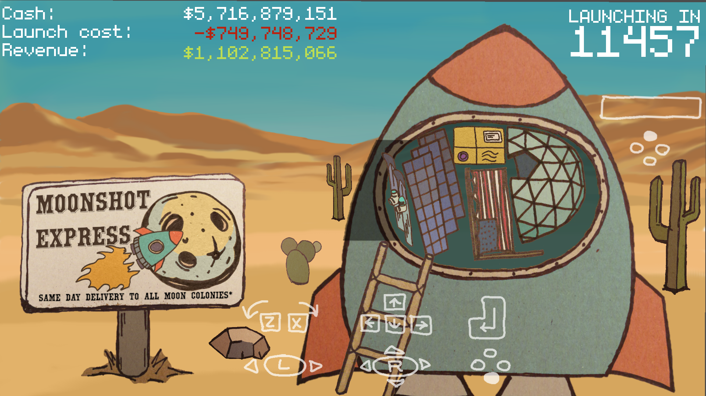

Moonshot Express
================

_This mini game is a submission for [Game Off
2020](https://itch.io/jam/game-off-2020) game jam._

Moonshot Express is the first private space delivery company. Its
reusable rockets fly to to the Moon every 60 seconds. But even reusable
rockets cost a lot to launch. You're a billionaire CEO, and your job is
to keep the enterprise profitable. But it's an easy job, really. Load as
much stuff as possible on each space craft, and you will keep Moon
colonists happy, and earn more billions.

## Controls

* Press Space or controller (A) to start the game / begin the next round.
* When presented with a choice of items to load, choose the best one with arrow keys and Enter (or controller left stick and the (A) button).
* Use arrow keys (or AWSD, or controller right stick) to move the selected item. Z/X (or controller left stick) to rotate it. Place it inside the rocket and press Enter or controller (A). You will be paid upfront.
* Repeat until the countdown runs to zero, and the rocket launches. Launch it anytime by pressing Space or controller (Y).
* Press Esc or (Start) to pause the game and open game menu.
* Press M to mute sound.

## Credits

Graphics: Elena Astanina

Music: Ludum Dare 38 by Abstraction (CC-BY-SA).

Sound FX: alienxx, darkunst, plasterbrain, scott0642, Sound_Explorer, Muska66,
rioforce, Marianne Gagnon, Edoardo Vallariello.

Fonts: monogram by datagoblin, Montague by Typographer Mediengestaltung.

